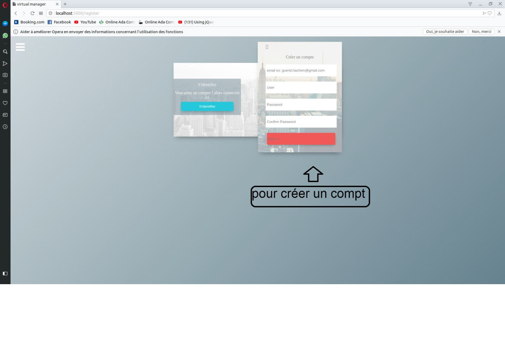
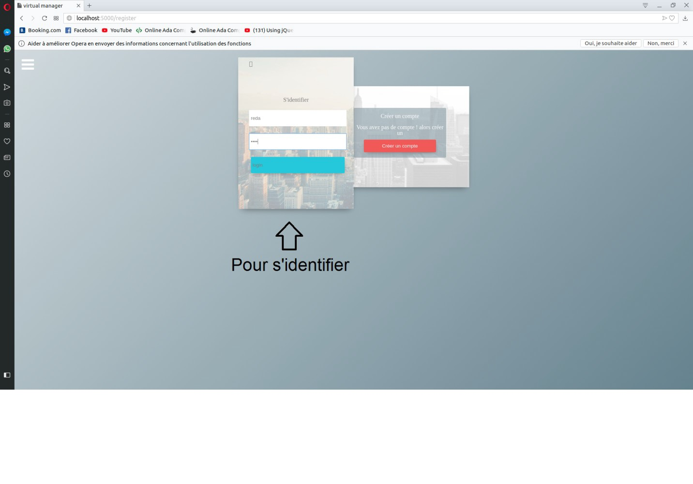
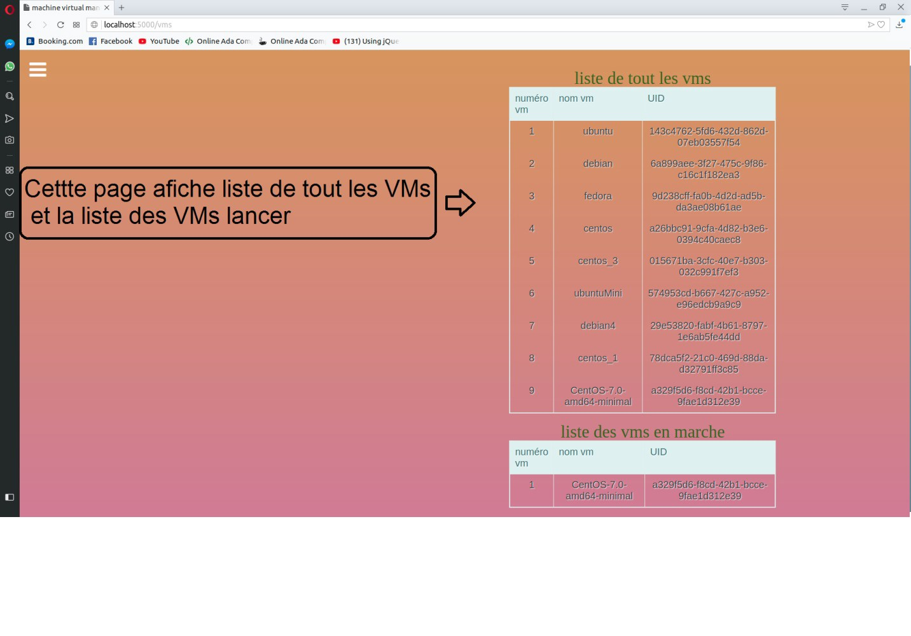
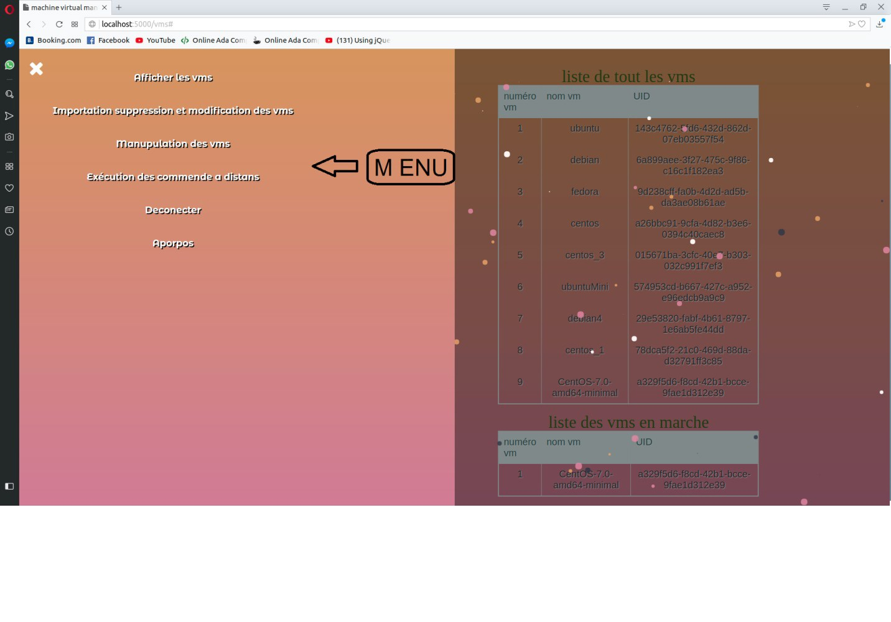
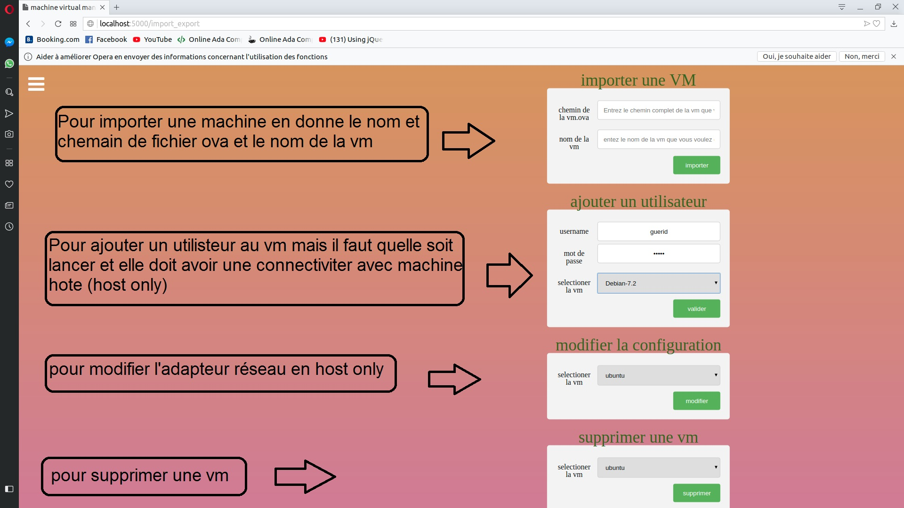
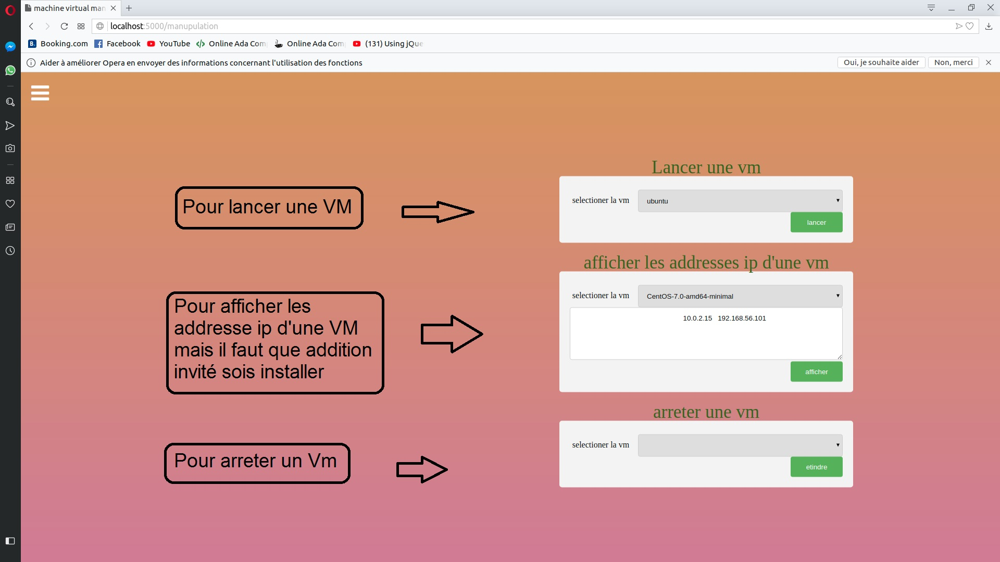
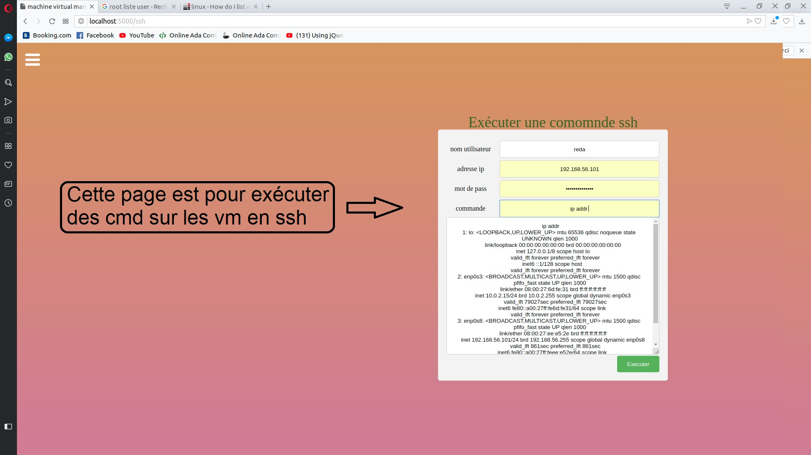

# MiniCloud
i develop Web service using python flask that can create or start or shutdown a virtual machine with VboxmanageCMD 

## Project screen shot  

## License
[MIT](https://choosealicense.com/licenses/mit/)
